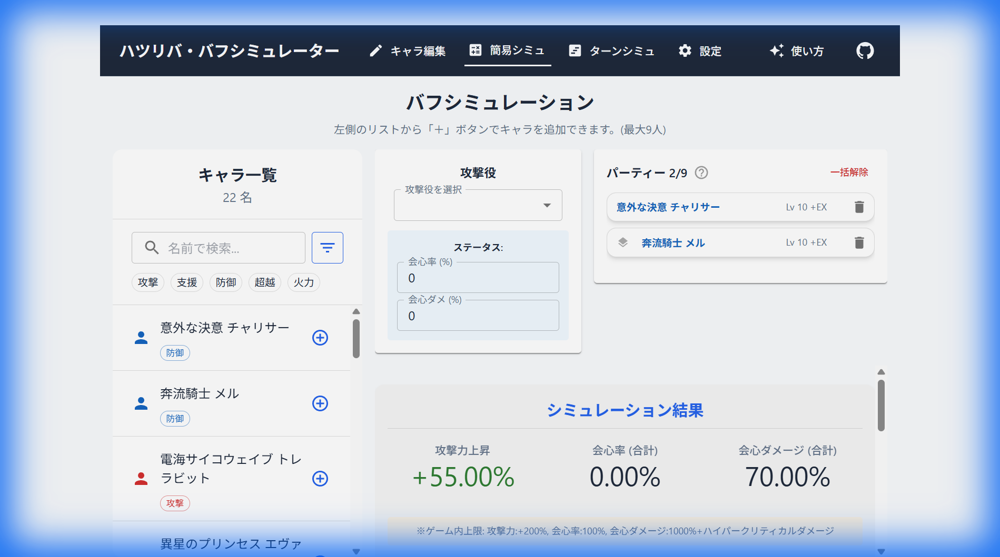
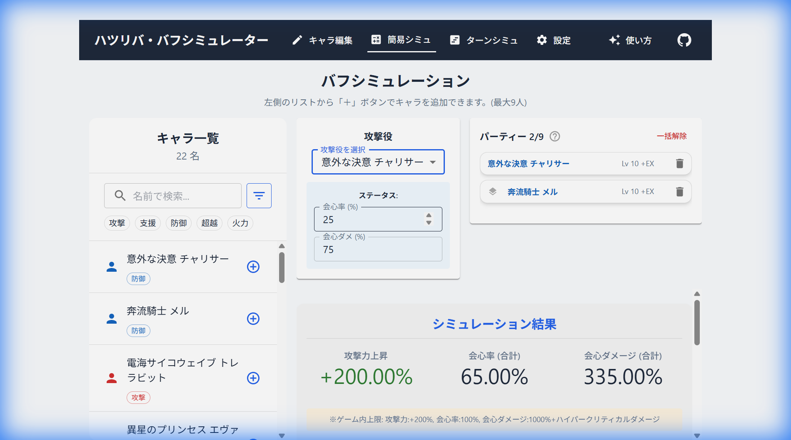
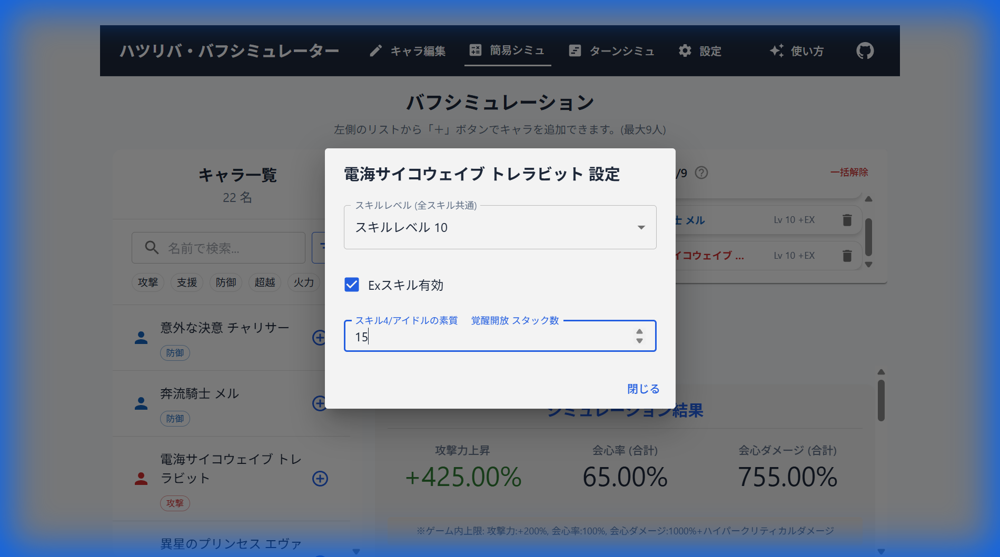
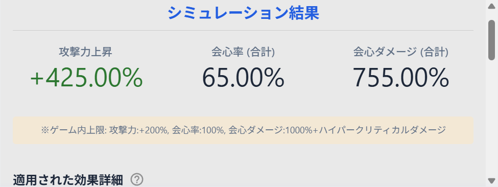
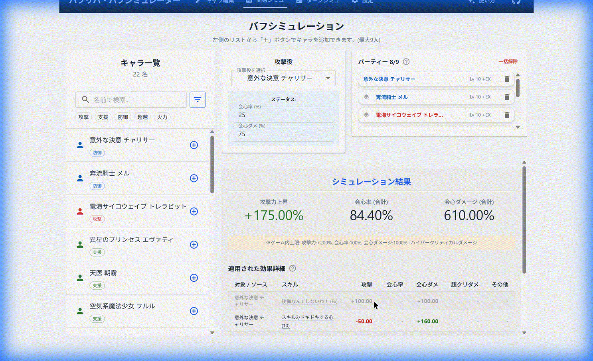

# 簡易シミュレーター（バフシミュ）の使い方

簡易シミュレーターでは、選択したパーティーメンバーによるバフの合計効果を簡単に計算することができます。
利用手順は以下の通りです。

## 1. パーティーの作成

画面左側の「キャラ一覧」から、パーティーに加えたいキャラクターの「+」ボタンをクリックして追加します。
追加されたキャラクターは右側の「パーティー」欄に表示されます。（最大9人まで）

## 2. アタッカー（支援対象）の設定

このシミュレーターでは、「誰（アタッカー）」に対して「みんな」がバフをかけるかを計算します。
中央の「攻撃役」ドロップダウンから、バフを受け取る対象となるアタッカーを選択してください。

※ アタッカー自身の持つ自己バフなども計算に含まれます。

## 3. スキル・スタック数の設定

一部のキャラクターは、Exスキルやスタック数によってバフの効果量が変化します。
パーティー欄のキャラクターをクリックすると設定画面が開き、以下の項目を変更できます。

*   **スキルLv**: 基本的に最大レベルで計算されますが、必要に応じて確認してください。
*   **Ex**: Exスキルの解放状態を切り替えます。
*   **スタック数**: スタックスキルを持つキャラクターの場合、スタック数を入力できます。

## 4. 結果の確認

画面下部の「シミュレーション結果」に、計算された合計バフ量が表示されます。

*   **攻撃力上昇**: アタッカーの攻撃力に対するバフの合計（%）。
*   **会心率（合計）**: アタッカーの素の会心率 + バフによる上昇量。
*   **会心ダメージ（合計）**: アタッカーの素の会心ダメージ + バフによる上昇量 + ハイパークリティカルダメージ。

## 5. 個別効果のON/OFF

「シミュレーション結果」の下に表示される「適用された効果詳細」のリストでは、個別のバフ効果をクリックすることで、計算への反映をON/OFF（有効/無効）切り替えることができます。
特定のバフを除外した場合の効果量を確認したい場合に便利です。

*   **有効**: 通常表示
*   **無効**: グレーアウト（半透明）表示

